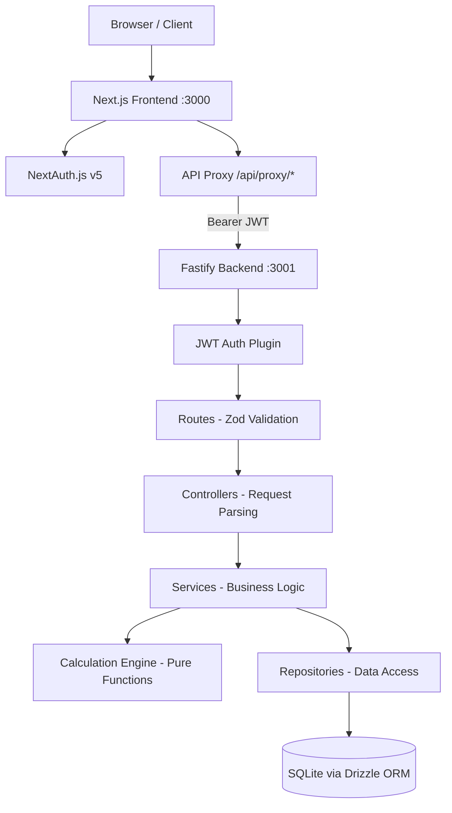

# Architecture

## System Flow



## Layer Responsibilities

```
Routes          → Schema validation (Zod), auth guards, Swagger tags
                  Does NOT contain business logic.

Controllers     → Parse request, delegate to service, format response.
                  Thin bridge between HTTP and business logic.

Services        → Orchestrate business operations. Call engine for
                  calculations, call repository for persistence.
                  Does NOT access database directly.

Engine          → Pure functions. Zero side effects. No imports from
                  db/, modules/, or external services. Trivially testable.

Repositories    → Drizzle ORM queries. Every query filters by userId
                  for row-level authorization. Does NOT know business rules.
```

## Technology Decisions

### Why Fastify (not Express or NestJS)

| Criteria | Fastify | Express | NestJS |
|----------|---------|---------|--------|
| Performance | Fastest Node.js framework | Slower (no schema-based serialization) | Overhead from decorators/DI |
| Schema validation | Native with Zod via `fastify-type-provider-zod` | Requires middleware | Built-in but verbose |
| Swagger generation | Auto from Zod schemas (zero duplication) | Manual with swagger-jsdoc | Auto but heavier setup |
| TypeScript DX | Excellent with type providers | Needs extra config | Good but verbose |
| Testing | `app.inject()` - no HTTP server needed | Supertest required | TestingModule boilerplate |
| Learning curve | Moderate | Low | High |

**Decision:** Fastify gives us the best balance of performance, built-in schema-driven validation, and auto-generated Swagger docs from Zod schemas. The `app.inject()` pattern makes integration testing clean without spinning up an HTTP server.

### Why Drizzle ORM (not Prisma or raw SQL)

| Criteria | Drizzle | Prisma | Raw SQL |
|----------|---------|--------|---------|
| Bundle size | ~50KB | ~8MB (query engine) | 0 |
| Type safety | Full (SQL-like DSL) | Full (generated client) | Manual |
| Migrations | SQL files via drizzle-kit | Prisma Migrate | Manual |
| SQLite support | Native | Supported | Native |
| Runtime overhead | Minimal | Query engine process | Zero |
| SQL familiarity | Reads like SQL | Custom query language | Is SQL |

**Decision:** Drizzle is lightweight, type-safe, and generates standard SQL migrations. Unlike Prisma, there's no heavy query engine binary, which matters for Docker image size and SQLite simplicity. The SQL-like syntax means no abstraction penalty when reading queries.

### Why Vitest (not Jest)

- **Speed:** Vite-native, significantly faster than Jest for TypeScript projects
- **Compatibility:** Jest-compatible API, zero learning curve
- **ESM-native:** First-class ESM support (our project uses `"type": "module"`)
- **Single config:** Same Vite transform pipeline as the dev server

### Why Deterministic Model (not Monte Carlo)

| Criteria | Deterministic + Bands | Monte Carlo |
|----------|----------------------|-------------|
| Reproducibility | Same inputs = same outputs | Random each run |
| Testability | Trivially assertable | Requires statistical assertions |
| UI complexity | 3 lines (expected, upper, lower) | Distribution chart / histogram |
| User understanding | Intuitive "best/expected/worst" | Requires probability literacy |
| Implementation | Simple compound interest x3 | Random number generation, >1000 paths |

**Decision:** For a portfolio project focused on demonstrating clean architecture and correct financial calculations, a deterministic model with volatility bands provides clear, testable, reproducible results. The three lines (expected, upper bound, lower bound) communicate the volatility concept without requiring statistical visualization.

### Rate Conversion

Annual to monthly rate uses compound conversion, NOT simple division:

```
monthlyRate = (1 + annualRate)^(1/12) - 1
```

Example: 12% annual → ~0.9489% monthly (not 1.0%)

### Volatility Interpretation

Volatility is modeled as a symmetric annual rate deviation:
- **Upper band rate:** `expectedAnnualRate + volatility`
- **Lower band rate:** `max(0, expectedAnnualRate - volatility)`
- Each band is computed as an independent compound interest series

Example: 15% expected, 5% volatility → Upper at 20%, Lower at 10%

## File Structure

```
backend/src/
├── app.ts                              # App factory (Fastify instance)
├── server.ts                           # Entry point
├── config/env.ts                       # Env validation (Zod)
├── db/                                 # Database layer
│   ├── client.ts                       # Drizzle + @libsql/client
│   ├── schema.ts                       # Re-exports all models
│   └── migrate.ts                      # Migration runner
├── engine/                             # Pure calculation functions
│   ├── tax.ts                          # IOF + IR calculations
│   ├── fixed-income.ts                 # Compound interest
│   ├── variable-income.ts              # Deterministic + volatility bands
│   ├── comparison.ts                   # Percentage difference
│   └── index.ts                        # Re-exports
├── modules/
│   ├── auth/
│   │   ├── user.model.ts               # Drizzle schema
│   │   ├── auth.schemas.ts             # Zod validation
│   │   ├── auth.routes.ts              # Route definitions
│   │   ├── auth.controller.ts          # Request handling
│   │   ├── auth.service.ts             # Business logic
│   │   └── auth.plugin.ts              # JWT decorator
│   └── simulations/
│       ├── simulation.model.ts         # Drizzle schema
│       ├── simulation.schemas.ts       # Zod validation
│       ├── simulation.routes.ts        # Route definitions
│       ├── simulation.controller.ts    # Request handling
│       ├── simulation.service.ts       # Business logic
│       ├── simulation.repository.ts    # Data access
│       └── __tests__/                  # Integration tests
└── plugins/                            # Fastify plugins
    ├── swagger.ts
    ├── cors.ts
    └── error-handler.ts
```
